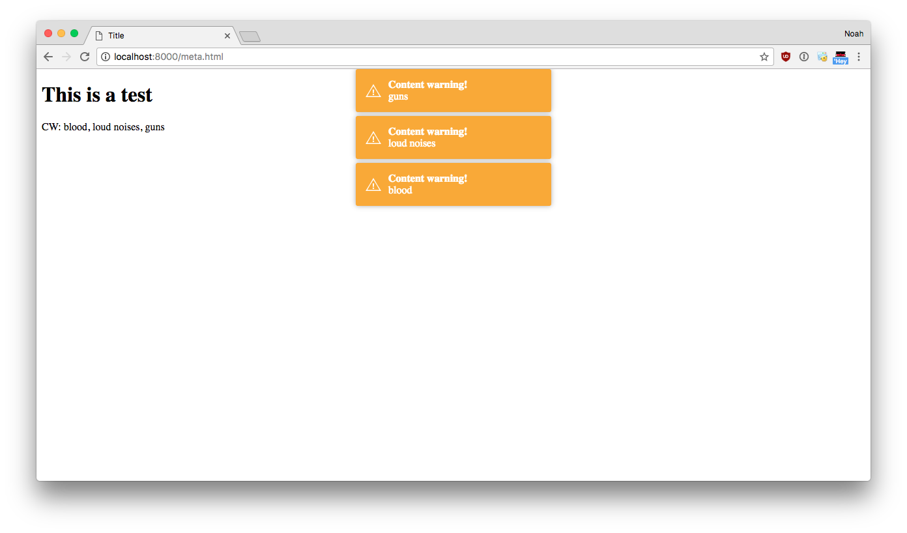

cw
===

cw is chrome extension to make content warnings easier to notice.

It looks like this... 

## Design
cw is built on a consumer system. Where consumers run against a single HTML page and produce a list of possible content warnings in that page. Consumers are run every time the DOM is updated, allowing them to work on dynamic websites. 
cw collects the data from all the consumers and shows warning dialogs only one time for each content warning.  So if many consumers produce the same warning, it will only be shown once. 

### regex-consumer (prototype done)

This consumer will look for text like “CW: thing, thing 2, thing 3”. The regex consumer can be suppressed for specific text using a simple `\` escape. 

### tag-consumer (prototype done)

Part of this project, will define a tag thing for HTML, which will allow warnings to be attached to certain elements. You can read more about this in [format.md](format.md)

### brain-consumer (planned)

This consumer will look for words and phrases and make warnings based on their frequency.

### personal-consumer (planned)

This consumer will look for specific words the user has defined.
